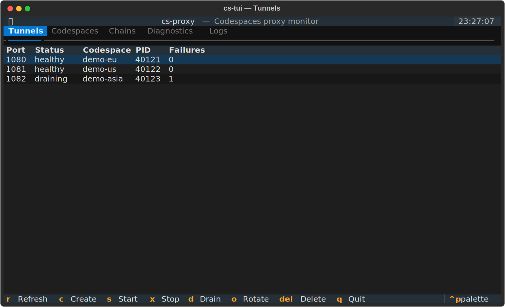
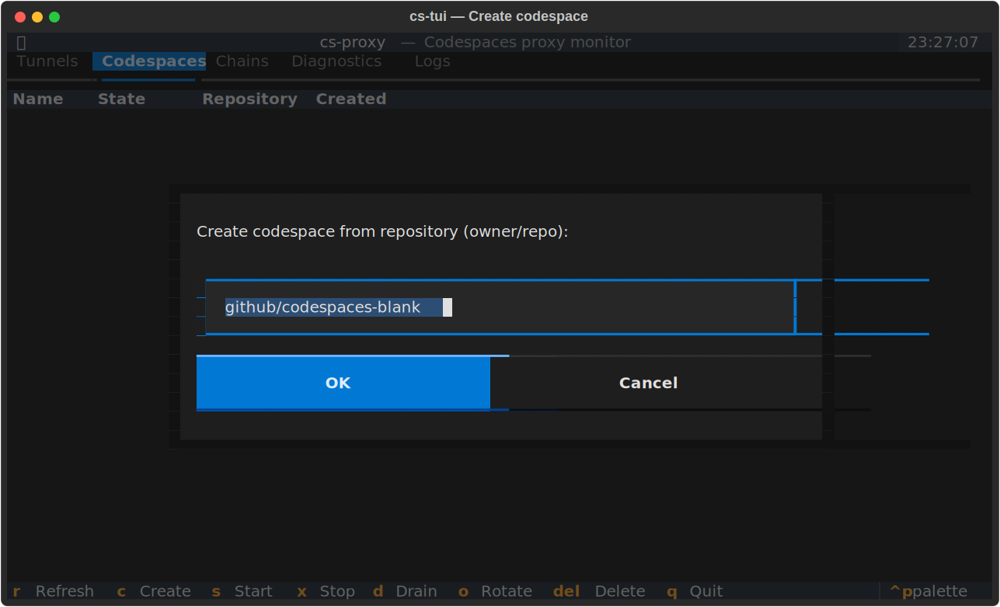

<p align="center">
  
</p>

<h1 align="center">Fluffy-Barnacle</h1>

<p align="center">
  <b>Disposable, ephemeral network infrastructure powered by GitHub Codespaces.</b><br>
  Deploy SOCKS5 proxies, HTTPS file hosting, and WireGuard tunnels in seconds, for free.
</p>

<p align="center">
  
  <a href="LICENSE"></a>
  <a href="https://github.com/psf/black"></a>
</p>

---
> [!WARNING]
> This software is provided strictly for **educational, research, and authorized security testing purposes.** 
>
> **GitHub's Terms of Service** and **Acceptable Use Policies** explicitly prohibit certain uses of Codespaces, including:
> 
> - Using Codespaces to disrupt services, gain unauthorized access to networks/devices, or support attack infrastructure (see [GitHub Terms for Additional Products and Features - Codespaces section](https://docs.github.com/en/site-policy/github-terms/github-terms-for-additional-products-and-features#codespaces)).
> - Placing disproportionate burden on GitHub's servers (e.g. excessive bandwidth, proxy/CDN-like usage).
> - Any activity violating applicable laws, third-party rights, or GitHub's Acceptable Use Policies (e.g. unauthorized scanning, proxying for malicious purposes).
> 
> Misuse may result in suspension/termination of your GitHub account, Codespaces access restrictions, or other enforcement actions by GitHub.
> The author is not liable for any harm or damage resulting from its unauthorized use.

## Documentation

Full documentation at **[https://dstours.github.io/fluffy-barnacle/](https://dstours.github.io/fluffy-barnacle/)**

## What is Fluffy-Barnacle?

**Fluffy-Barnacle** is an operator-focused toolkit that turns GitHub Codespaces into free, ephemeral network infrastructure. It provides a suite of CLI tools for rapid deployment and teardown.

| Tool | Description |
|------|-------------|
| **cs-proxy** | SOCKS5 and HTTP proxy via SSH tunnel with auto-reconnect, circuit breaker, and Burp Suite integration |
| **cs-serve** | Instant public HTTPS file hosting, redirect servers, custom HTTP responses, and data capture via `*.app.github.dev` |
| **cs-wg** | Full WireGuard VPN tunnel with route management and traffic monitoring |
| **cs-tools** | Drop-in wrappers for nmap, ffuf, httpx, nuclei, sqlmap with automatic SOCKS5 proxy arguments and smart tunnel rotation |
| **cs-mcp** | Model Context Protocol server exposing the toolkit to MCP-aware clients (Claude Desktop, Claude Code, Cursor) |

Codespace IPs rotate on each creation, giving you fresh egress IPs on demand. Each tool works from the CLI or as a Python library.

## Quick Start

```bash
pip install -e .
gh auth login
cs-proxy check               # verify your setup
cs-proxy start
cs-tools ipcheck             # verify you're proxied
```

See the [Quick Start Guide](https://dstours.github.io/fluffy-barnacle/quickstart/) for detailed setup.

## Feature Highlights

### SOCKS5 Proxy with Auto-Reconnect & Circuit Breaker

```bash
cs-proxy start                                # single proxy, auto-select codespace
cs-proxy start                                # (if already running) adds another codespace + tunnel
cs-proxy create                               # create a new codespace and track it
cs-proxy start                                # picks up unstarted tracked codespaces
cs-proxy -n 2 start -l WestEurope -l EastUs  # two proxies, different regions (ports 1080 + 1081)
cs-proxy status             # codespace state + per-tunnel exit IP
cs-proxy status --watch     # auto-refresh every 2 seconds
cs-proxy doctor --fix       # diagnose and repair safe local state/config issues
cs-proxy pool list          # list managed tunnel pool entries
cs-proxy pool rotate        # print a healthy tunnel port for scripts
cs-proxy ssh                # interactive shell (menu if multiple codespaces tracked)
cs-proxy env                # export statements for tools that read env vars
cs-proxy burp               # upstream proxy config for Burp Suite
cs-proxy pac                # generate Proxy Auto-Config (PAC) file
cs-proxy chain create eu-us --hop WestEurope --hop EastUs
cs-proxy chain start eu-us  # local SOCKS -> EU Codespace -> US Codespace
cs-proxy check              # diagnose setup, auth, ports, and state health
cs-tui                      # interactive terminal dashboard (or: cs-proxy tui)
```

### Terminal UI (cs-tui)

A live terminal dashboard for monitoring **and managing** tunnels, codespaces,
diagnostics, and logs — built on [Textual](https://textual.textualize.io/). It
reads the same state and drives the same service layer as the CLI, and
auto-refreshes.



```bash
pip install 'fluffy-barnacle[tui]'   # one-time: install the optional TUI extra
cs-tui                               # launch the dashboard
```

The tabs — **Tunnels**, **Codespaces**, **Chains**, **Diagnostics**, **Logs** —
each carry their own selectable rows. All blocking work runs in a background
worker, so the UI never freezes while a `gh`/`ssh` call is in flight.

Actions operate on the selected row of the active tab (destructive ones ask for
confirmation first):

| Key | Action |
|-----|--------|
| `r` | Refresh now |
| `c` | Create a codespace (Codespaces tab; prompts for `owner/repo`) |
| `s` | Start the selected codespace / chain |
| `x` | Stop the selected tunnel / codespace / chain (confirm) |
| `d` | Drain the selected tunnel |
| `o` | Show a healthy tunnel port (rotate) |
| `Del` | Delete the selected codespace / chain definition (confirm) |
| `q` | Quit |

On the **Codespaces** tab, `c` opens an input modal to create a new codespace.
It is prefilled with `github/codespaces-blank` (override the default via the
`codespace_repo` config key); type any `owner/repo` and press Enter to provision
it in the background.



The **Chains** tab lists defined and running two-hop chains; each hop shows its
region and, when bound to a named account, the account that PAT belongs to
(e.g. `WestEurope · work`) so multi-account setups are clear at a glance.

**Adding a second proxy:**

There are two workflows for running multiple exit IPs:

1. **Auto-add:** Run `cs-proxy start` again when a proxy is already running — it creates a new codespace and starts a second tunnel automatically.
2. **Manual:** Run `cs-proxy create` to create a codespace first, then `cs-proxy start` to tunnel it (skips the first running tunnel and starts one for the new codespace).

**Dry-run mode:**

```bash
cs-proxy --dry-run start    # show what would happen without making changes
cs-proxy --dry-run stop     # show what would stop without stopping anything
```

**Shell completion:**

```bash
cs-proxy completion bash > ~/.config/cs-proxy/completion.bash
source ~/.config/cs-proxy/completion.bash
```

### Smart Proxy Rotation

`cs-tools` automatically picks a healthy tunnel from `state.json`. If you have multiple tunnels running, tool traffic is rotated across them without manual port selection.

### Two-Hop Codespaces Chains

Experimental chain mode routes one local SOCKS endpoint through two Codespaces:

```bash
cs-proxy chain create eu-us --hop WestEurope --hop EastUs
cs-proxy chain start eu-us --port 1080
cs-proxy chain status eu-us
cs-proxy chain stop eu-us
```

The first hop runs a SOCKS relay and the second hop runs a WebSocket exit relay. Chain mode is intended for authorized testing of region-specific routing behavior and adds latency.

Named accounts can be used when each hop should be managed with a different PAT:

```bash
export GH_TOKEN_EU=...
export GH_TOKEN_US=...
cs-proxy account add eu --token-env GH_TOKEN_EU
cs-proxy account add us --token-env GH_TOKEN_US
cs-proxy chain create eu-us --hop eu:WestEurope --hop us:EastUs
```

Raw PATs are intentionally not accepted as command arguments.

### Public File Hosting

```bash
cs-serve file payload.bin                               # serve a file
cs-serve redirect http://169.254.169.254/metadata/      # SSRF redirect
cs-serve custom 9999 '{"pwned":true}' application/json  # custom response
cs-serve capture                                        # capture POST data
cs-serve -d dev.example.com file payload.bin            # custom domain via Cloudflare
```

### WireGuard VPN

```bash
cs-wg up
cs-wg route add 192.168.10.0/24    # route a specific subnet
cs-wg route all                     # route everything
cs-wg monitor http                  # tcpdump with labeled output
cs-wg down
```

### Proxied Tool Wrappers

```bash
cs-tools ipcheck
cs-tools pnmap -p 80,443,8080 target.com
cs-tools pffuf -u https://target.com/FUZZ -w list.txt
cs-tools phttpx -l domains.txt -title -status-code
cs-tools pcs gobuster dir -u https://target.com -w list.txt
```

`cs-tools` supports global flags before the tool name:

```bash
cs-tools --port 1081 pcurl https://target.com      # pin to a specific tunnel
cs-tools --dry-run pnmap -p 80 target.com           # preview the command
cs-tools --timeout 900 pnmap -sV -p- target.com     # override default timeout
```

`pnmap` automatically sanitizes nmap arguments — it strips incompatible flags (`-sS`, `-sU`, `-O`, `--traceroute`) and forces `-sT -Pn` to keep traffic inside the SOCKS tunnel. Running nmap as root would default to SYN scan and **leak your real IP**; `cs-tools` prevents this.

## Installation

**Requirements:** Python 3.10+, [GitHub CLI](https://cli.github.com/) (`gh`), `ssh`, `curl`

```bash
git clone https://github.com/dstours/fluffy-barnacle.git
cd fluffy-barnacle
pip install -e .
```

Optional dependencies for specific features:

- `wg`, `wg-quick`, `socat`, `ip` -- for `cs-wg`
- `proxychains4`, `tinyproxy` -- for `cs-proxy proxychains` / `cs-proxy http`
- `tcpdump` -- for `cs-wg monitor`

See the [Installation Guide](https://dstours.github.io/fluffy-barnacle/user-guide/installation/) for platform-specific instructions.

## Python API

```python
from csproxy import SSHTunnel, Config, GitHubManager, CodespaceSelector, GitHubAccount

config = Config()
gh = GitHubManager()
cs_name = CodespaceSelector(gh, config).select()

tunnel = SSHTunnel(config, cs_name)
tunnel.start()

from csproxy import check_proxy, ipcheck, pnmap
if check_proxy():
    ipcheck()
    pnmap(['-p', '80,443', 'target.com'])
```

## Configuration

Config file: `~/.config/cs-proxy/config.yaml`

```yaml
socks_port: 1080
http_proxy_port: 8080
num_proxies: 1              # 1-2 on free tier; each gets its own tunnel on consecutive ports
codespace_name: ""
locations: []               # e.g. [WestEurope, EastUs] — one region per codespace
reconnect_delay: 5
max_reconnect_delay: 300
verbose: false

# Named accounts store token environment variable names, not token values.
accounts:
  eu:
    token_env: GH_TOKEN_EU
  us:
    token_env: GH_TOKEN_US

# Chain definitions are usually managed with `cs-proxy chain create`.
chains: {}

# Profiles let you switch between preset configurations
profile: ""
profiles:
  redteam:
    num_proxies: 2
    locations: [WestEurope, EastUs]
  stealth:
    dns_proxy: true
    verbose: true
```

See the [Configuration Reference](https://dstours.github.io/fluffy-barnacle/user-guide/configuration/) for all options, environment variables, and profiles.

## License

[Apache-2.0](LICENSE)
