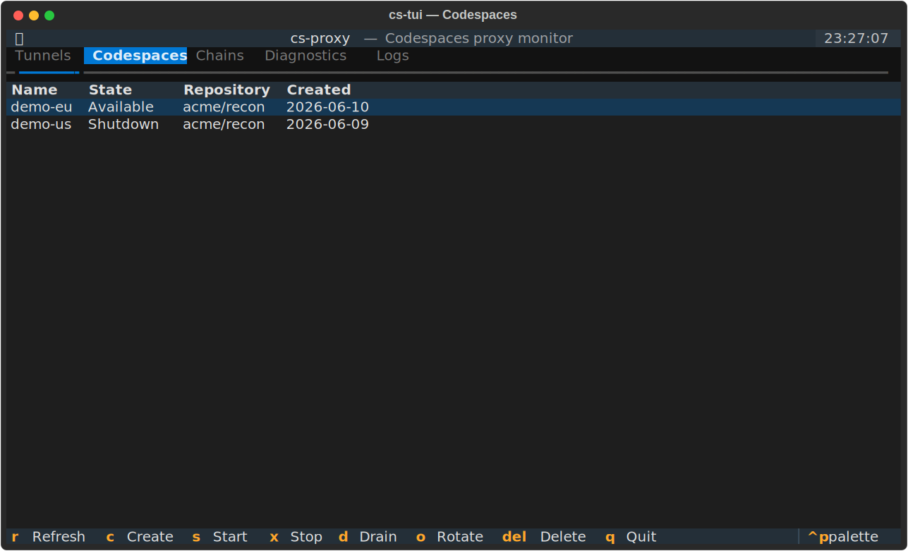

# cs-tui

A live terminal dashboard for monitoring **and managing** tunnels, codespaces, diagnostics, and logs — built on [Textual](https://textual.textualize.io/). It reads the same state and drives the same service layer as the CLI, so anything you do in the TUI is reflected by `cs-proxy` and vice versa.


The TUI ships as an optional extra (it pulls in Textual):

```bash
pip install 'fluffy-barnacle[tui]'   # one-time: install the optional TUI extra
cs-tui                               # launch the dashboard (or: cs-proxy tui)
```

The dashboard auto-refreshes on a timer. All blocking work (the `gh`/`ssh`/`curl` subprocess calls behind the data) runs in a background worker, so the UI never freezes while a call is in flight, and destructive actions are gated behind a confirmation modal.

## Tabs

| Tab | Shows |
|-----|-------|
| **Tunnels** | The local SSH tunnel pool — port, health status, backing codespace, PID, failure count |
| **Codespaces** | Your GitHub Codespaces — name, state, repository, creation date |
| **Chains** | Defined and running two-hop chains; each hop shows its region and, when bound to a named account, the account that PAT belongs to (e.g. `WestEurope · work`) |
| **Diagnostics** | The same dependency/config health checks as `cs-proxy check` |
| **Logs** | A tail of `proxy.log` |

## Key bindings

Actions operate on the **selected row of the active tab**. Destructive actions ask for confirmation first.

| Key | Action |
|-----|--------|
| `r` | Refresh now |
| `c` | Create a codespace (Codespaces tab; prompts for `owner/repo`) |
| `s` | Start the selected codespace / chain |
| `x` | Stop the selected tunnel / codespace / chain (confirm) |
| `d` | Drain the selected tunnel |
| `o` | Show a healthy tunnel port (rotate) |
| `Del` | Delete the selected codespace / chain definition (confirm) |
| `q` | Quit |

If a key doesn't apply to the active tab (e.g. `d` Drain on the Codespaces tab), the TUI shows a brief warning instead of acting.

## Creating a codespace

On the **Codespaces** tab, press `c` to open an input modal. It is prefilled with `github/codespaces-blank` — a public template that always supports Codespaces — so the field is never empty. Override the default by setting the `codespace_repo` key in your config.


Type any `owner/repo` and press **Enter** (or click **OK**) to provision. Creation runs in the background and can take a minute; the new codespace appears on the tab once it is `Available`. Press **Esc** (or **Cancel**) to abort without creating.

Codespaces are created with an explicit machine type (`basicLinux32gb`, the smallest standard Linux machine). A concrete machine is required because, without one, `gh codespace create` prompts interactively and fails in the non-interactive worker thread the TUI uses.

## Stop vs. delete



The Codespaces tab distinguishes the two cleanly:

- **`x` Stop** suspends the codespace (`gh codespace stop`). It keeps existing and can be restarted with `s`; only compute stops.
- **`Del` Delete** destroys it permanently (`gh codespace delete --force`).

Stopping a **tunnel** (`x` on the Tunnels tab) only tears down the local SSH process — it never touches the backing codespace.

## Draining

`d` marks the selected tunnel as `draining` (`cs-proxy pool drain <port>`). The tunnel keeps serving existing connections, but `o` Rotate only ever returns `healthy` tunnels, so a draining tunnel is excluded from being handed out for new work. Stop it with `x` once it is idle. See [cs-proxy → pool](cs-proxy.md) for the equivalent CLI commands.

## See also

- [cs-proxy](cs-proxy.md) — the CLI that backs every TUI action (`pool`, `chain`, `start`/`stop`, diagnostics).
